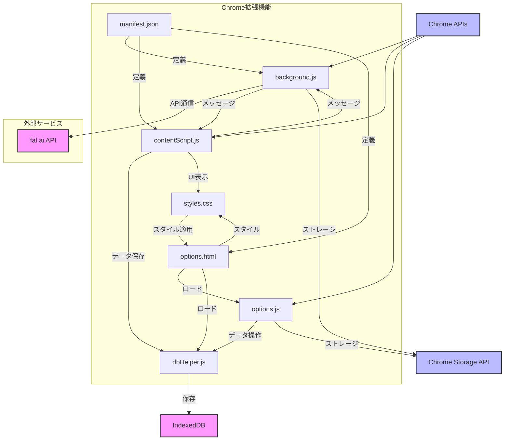

# モジュール依存関係図

## 依存関係の説明

### コアモジュール間の依存関係
- `manifest.json` はすべてのコンポーネントの設定と権限を定義
- `background.js` は拡張機能のバックグラウンドプロセスとしてfal.ai APIとの通信を管理
- `contentScript.js` はWebページ上でのUI表示と音声再生を担当
- `dbHelper.js` はIndexedDBを使用したデータ永続化を提供
- `options.js` は設定と保存済み音声の管理インターフェースを提供

### 外部依存関係
1. Chrome APIs
   - Storage API: 設定の保存
   - Tabs API: タブ管理
   - Runtime API: メッセージング
   - ContextMenus API: 右クリックメニュー

2. 外部サービス
   - fal.ai API: 音声合成サービス

3. ブラウザAPI
   - IndexedDB: 音声データの永続化
   - Audio API: 音声再生

### データフロー
1. ユーザー操作 → `contentScript.js`
2. `contentScript.js` → `background.js` → fal.ai API
3. 音声データ → `dbHelper.js` → IndexedDB
4. 設定データ → Chrome Storage API